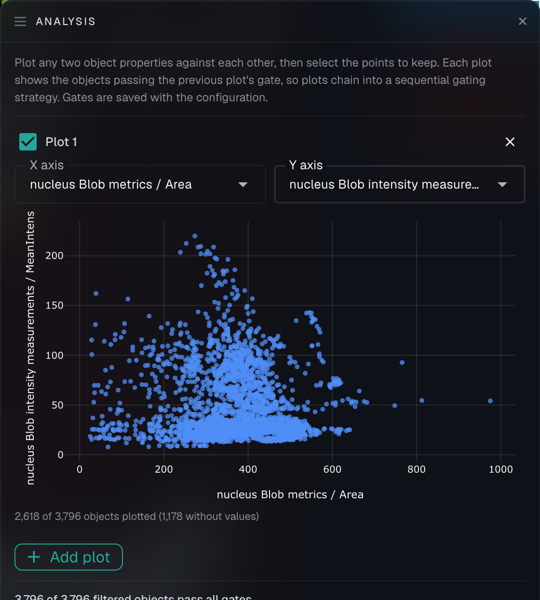

# Analysis plots and gating

Once you have computed properties for your objects, the **Analysis** panel lets you plot those measurements against each other and select populations directly from the plot — the same way you would gate a flow cytometry experiment. Open it from the scatter-plot icon in the app bar.

<figure><figcaption>
The Analysis panel plotting nucleus area against mean intensity for a time-lapse dataset
</figcaption></figure>

## Making a plot

Click **Add plot** and choose an X and a Y axis. Each can be:

* **A computed property value** — for example `nucleus Blob metrics / Area` or a per-channel intensity mean
* **A categorical field of the object itself** — tags, shape, channel, or XY / Z / time position

So you can plot area against intensity to find bright large cells, or plot an intensity against a tag to compare distributions between object classes.

Underneath the plot, a readout reports how many objects were drawn — for example "2,618 of 3,796 objects plotted (1,178 without values)". Objects that have no value for one of the chosen axes cannot be placed, so they are counted separately rather than silently dropped.

## Gating: selecting a population by drawing around it

Draw a lasso around the points you want, and that selection becomes a **gate**. A gate behaves exactly like a property-range filter: it narrows the image viewer, the Object Browser, the Connections list, and everything you export. The objects outside your lasso are still there — they are just filtered out of the current view.

This makes the panel a way of asking spatial questions about a measured population: gate the brightest 5% of cells in the plot, then look at where they actually sit in the image.

### Chaining plots into a gating strategy

Plots chain. The second plot shows only the population that passed the first plot's gate, the third shows what passed the first two, and so on — so a sequence of plots reads as a gating strategy, narrowing step by step.

A plot never applies its own gate to its own points, which is what lets you see and adjust the selection you just drew.


Gates are stored as the shape you drew, in property-value space — not as a list of the objects it happened to contain. That means a gating strategy travels correctly between datasets that share a configuration: draw it once on one replicate and it re-resolves against each dataset's own values.

One consequence is worth knowing for categorical axes: the category ordering in effect when you drew the gate is part of the gate's meaning, and travels with it. A category that wasn't present when you drew the gate falls outside it. If you add new tags and want them gated, redraw the gate.


## Very large datasets

On datasets with more objects than the panel plots as individual points (50,000 by default), plots switch to a **density heatmap** computed on the server, and gates are drawn as closed shapes or rectangles rather than freehand lassos.

Gating stays exact at any dataset size — the gate is resolved against every object on the server, not against a sample — so the counts you get are the real ones. This was validated on datasets of over 700,000 objects.


When a heatmap can't fully express an active filter — a region of interest, a hidden-layer rule, or a very large explicit object list — a banner says so. The picture may show more than is actually in scope, but it never shows less, and the gate itself always resolves correctly.


## Knowing when a gate is narrowing your view

Because a gate applies whether or not the Analysis panel is open, it is possible to load a dataset with a saved gate already active and wonder why you can see fewer objects than you expect.

Two cues tell you what's happening:

* The Analysis palette icon shows a badge counting the active gates.
* On large datasets, the object-count indicator over the image spells it out — for example "Showing 826 of 826 in view **(1 filter applied)**". Hovering names the specific constraints ("1 lasso gate on Area × PECAM1; 1 tag filter"), and clicking opens the panels that own them.

## Related

* [Measuring object properties](measuring-object-properties.md) — computing the values you plot
* [Interacting with objects](interacting-with-objects.md) — the Filters panel, which is the right tool for narrowing a dataset before plotting
* [Working with large annotation datasets](large-annotation-datasets.md) — how NimbusImage stays responsive at scale
