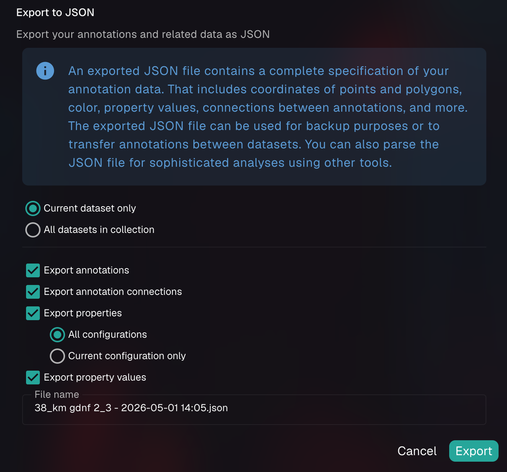

# Importing and exporting objects and properties

NimbusImage provides flexible options for exporting your analysis data, allowing you to perform additional analysis in external tools, back up your work, or transfer annotations between datasets. This section covers the different export formats and options available.

## Exporting data for analysis

After completing your image analysis in NimbusImage, you can export your data in several formats:

1. **CSV format** - For spreadsheet analysis in tools like Excel, R, or Python
2. **TSV format** - Tab-separated values, useful when property names contain commas
3. **JSON format** - For complete data backup or transfer between datasets

### Exporting properties as CSV or TSV

CSV export is ideal for statistical analysis and data visualization in external tools:

1. Open the **Import / export data** menu in the top toolbar
2. Select **"Export CSV"**
3. Configure your export options:
   * **Scope**: Export the current dataset only, or all datasets in the collection
   * **Annotations to Export**: All, filtered, or selected annotations
   * **File Format**: Choose between CSV (comma-separated) and TSV (tab-separated). CSV is the default.
   * **Property Export Options**: Choose to export all properties, only listed properties, or select specific properties
   * **Undefined Value Handling**: Decide how to represent missing values (Empty string, NA, or NaN)
4. Enter a filename
5. Click "DOWNLOAD"

The resulting file contains:

* Object identifiers and metadata (Id, Channel, XYZ coordinates, Time)
* Object tags and attributes
* All selected property values

<figure><figcaption>
The export dialog allows you to customize the file format, which properties to include, and how to handle missing values
</figcaption></figure>


We recommend using the empty string option for undefined values, because it is generally recognized by most analysis software.



If your property names contain commas (from older tag-based naming), the export dialog will display a warning recommending TSV format. TSV avoids column misalignment issues that commas in property names can cause in CSV files. Property names with commas are automatically quoted in CSV exports, but TSV is the more reliable option.


### Exporting complete annotation data as JSON

The JSON export provides a comprehensive record of all annotation data:

1. Open the **Import / export data** menu in the top toolbar
2. Select **"Export to JSON"**
3. Choose what to include:
   * Export annotations (objects)
   * Export annotation connections
   * Export properties
   * Export property values
5. Enter a filename
6. Click "EXPORT SELECTED ITEMS"

<figure><figcaption>
The JSON export dialog lets you select exactly which components of your analysis to include
</figcaption></figure>

The exported JSON file contains:

* Complete geometric data for all annotations (coordinates, shapes, colors)
* All connection information between objects
* Property definitions and calculated values
* Metadata about the dataset


JSON export is particularly valuable for:

* Creating a complete backup of your analysis
* Transferring annotations between compatible datasets
* Advanced programmatic analysis using the complete data structure
* Archiving analysis results alongside raw data


## Importing annotation data

NimbusImage allows you to import previously exported JSON files, making it possible to:

1. Restore annotations from backups
2. Transfer annotations between compatible datasets
3. Share analysis with collaborators

To import annotation data:

1. Navigate to the dataset where you want to import annotations
2. Open the **Import / export data** menu in the top toolbar
3. Select **"Import from JSON"**
4. Select your JSON file
5. Review the import options
6. Click "IMPORT"


When importing annotations, be aware that:

* The target dataset should have a compatible structure with the source dataset
* Importing will not overwrite existing annotations unless explicitly configured to do so
* For time-lapse datasets, ensure the time points in the imported data match the structure of your target dataset


## Data ownership and transparency

NimbusImage's export capabilities ensure that you maintain complete ownership of your analysis data. By supporting standard formats like CSV and comprehensive JSON exports, you can:

* Perform advanced analysis in your preferred tools
* Maintain complete backups of your work
* Share results transparently with collaborators
* Integrate NimbusImage analysis into broader workflows
* Create reproducible analysis pipelines

The combination of interactive analysis within NimbusImage and flexible data export options provides a powerful workflow that respects scientific integrity while maintaining ease of use.
