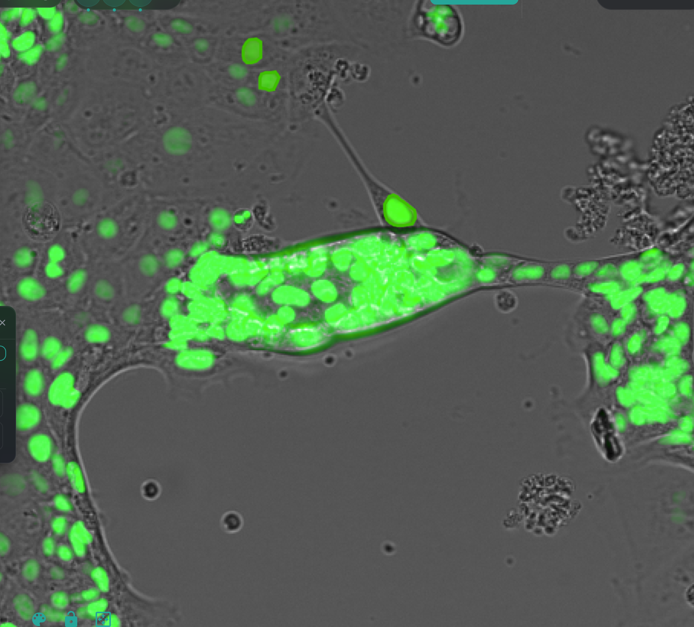
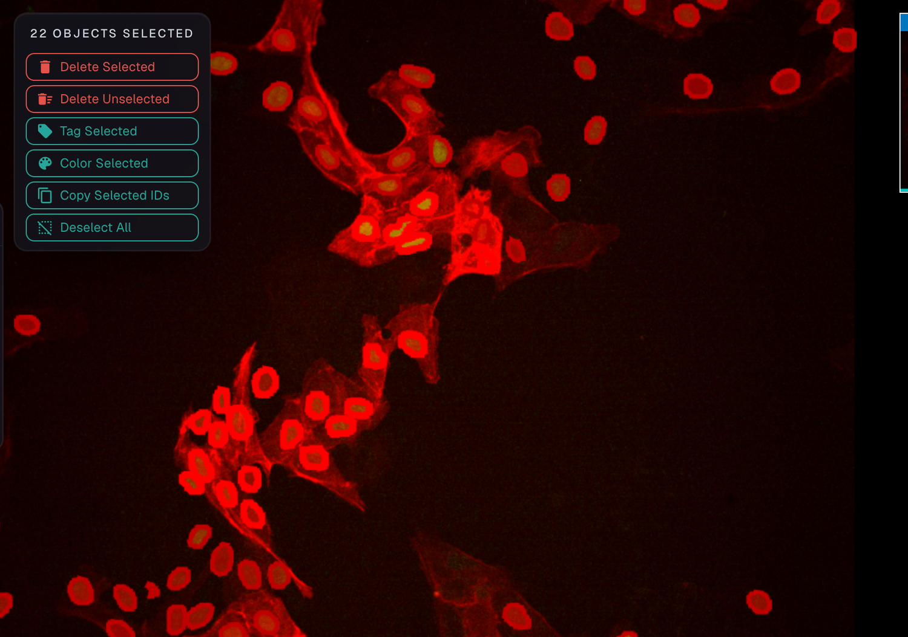
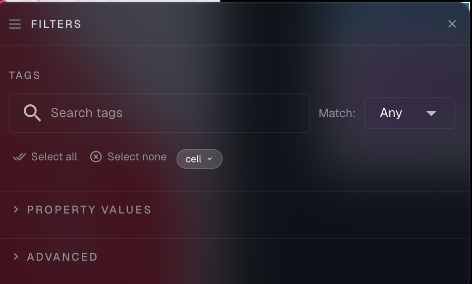
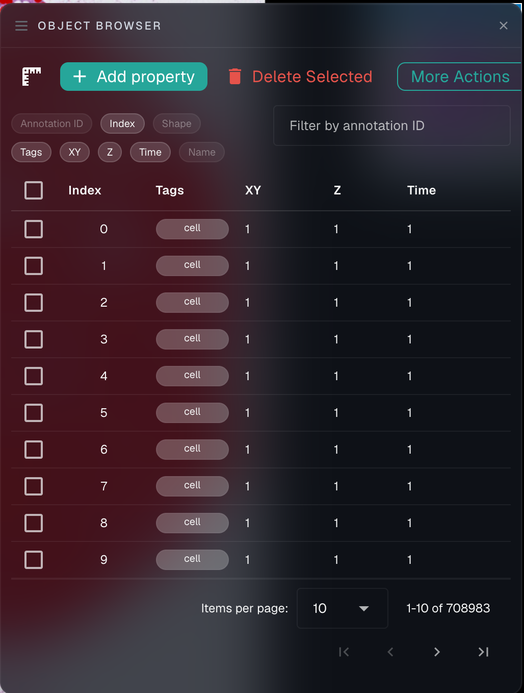
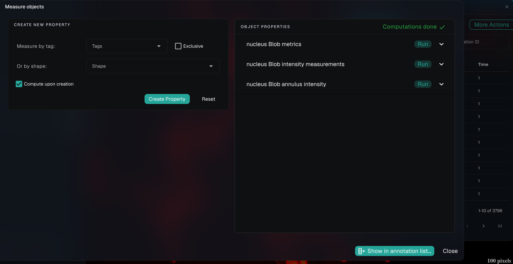

# Interacting with objects

One of the main advantages of working in NimbusImage is the ability to directly interact with your objects. This interactive approach allows you to quickly refine your analysis by removing incorrect objects, adding missing ones, and organizing them with tags—all within the same interface.

## Selecting and manipulating objects

<figure><figcaption>
Green blob objects drawn on an image
</figcaption></figure>

To interact with objects in your dataset:

* **Shift-drag** across objects to select multiple objects at once
* Once selected, a popup menu appears with several options:
  * **Delete selected** - Remove the selected objects
  * **Delete unselected** - Keep only the selected objects and remove all others
  * **Tag selected** - Add or change tags for the selected objects
  * **Color selected** - Apply custom colors to the selected objects
  * **Copy selected IDs** - Copy the object IDs to clipboard for reference

<figure><figcaption>
Shift-drag allows you to select objects, revealing a popup menu to allow deletion, tagging, coloring, and identification by ID
</figcaption></figure>


The selection tool is particularly useful for cleaning up results from automated segmentation. You can quickly remove falsely identified objects or select groups of objects to apply a consistent tag.


## Object browser and filtering

The Object Browser provides powerful tools for managing which objects are visible in your view:

<figure><figcaption>
The Filters panel shows options for showing and hiding particular tags, plus property-value and advanced filters
</figcaption></figure>

Key features include:

* **Tag filtering** - Filter objects by their tags (e.g., "nucleus" or "Brightfield blob")
* **Tag match options** - Choose if objects should match "Any" or "All" of the selected tags
* **Current frame only** - When enabled, shows only objects in the currently displayed time frame in the object list (helpful for time-lapse data)
* **Show annotations from hidden layers** - By default, annotations remain visible even when their corresponding layer is hidden; toggle this off to hide annotations when their layer is hidden

### Advanced filtering options

The Object Browser offers three powerful filtering mechanisms:

1. **Property value filter** - Filter objects based on measurements like area, intensity, or other computed properties
2. **Annotation ID filter** - Find specific objects by their unique IDs
3. **Region filter** - Draw a region of interest and show only objects within that area

These filters can be combined to precisely target objects meeting multiple criteria.

## Annotation list

The Annotation List provides a detailed tabular view of all objects in your dataset:

<figure><figcaption>
The annotation list shows all your objects
</figcaption></figure>

The list offers several useful features:

* **Customizable columns** - Show or hide information like Annotation ID, Index, Shape, Tags, XY coordinates, Z position, and Time
* **Sorting** - Click any column header to sort by that property
* **Navigation** - Click on any row to navigate directly to that object in the image viewer
* **Bulk actions** - Select multiple objects using the checkboxes and perform actions like deletion or tagging
* **Pagination** - For datasets with many objects, navigate through pages with the pagination controls


For very large datasets (hundreds of thousands of objects or more), NimbusImage loads annotations lazily and handles the list on the server so everything stays responsive. See [Working with large annotation datasets](large-annotation-datasets.md).


## Finding and showing measurements

The Object Browser has three tabs — **Objects**, **Measurements**, and **Connections** — and the first two both give you access to your computed properties without opening a separate dialog.

### The measurements chip strip

Above the object list on the Objects tab, a strip of chips shows one chip per computed property, each with an eye icon and a `shown / total` count. Click a single-value property's chip to toggle its column in the list; click a multi-value property's chip to open a compact checklist of its individual values, with Show all and Hide all.

A filter box in the strip matches both property **and** value names, so typing a gene name or a metric name surfaces it directly and narrows the chips' checklists to the match. A pinned **"+ New measurement…"** chip creates a property without leaving the panel. The strip is capped at about three rows and scrolls beyond that, so a dataset with many properties can't take over the panel.

### The Measurements tab

The Measurements tab lists every property — including ones you haven't computed yet — with value counts, "N shown" badges, per-value show/hide checkboxes, and a **Run** button per property so you can compute one without going through the Measure dialog. Compute errors and warnings appear here as alerts.

## Coloring objects by a property value

Beyond showing measurements as numbers, you can color your objects by them. Use the **Color objects by property** button in the app bar, or the annotation list's **More Actions → Color by Property…**, and pick a computed property — including a nested path such as a per-channel mean. Every object in the dataset then takes its color from its value, and a legend appears in the viewer explaining the mapping.

You can color either way:

* **Continuous** — values map onto a colormap ramp
* **Categorical** — each distinct value gets its own color from a palette


Continuous ramps span the 1st–99th percentile of your values by default rather than the full minimum-to-maximum extent. Real measurements often have a few extreme outliers, and stretching the ramp across them collapses everything else into one indistinguishable color. The legend still reports the true extent and marks the clipped ends with `≤` and `≥`.


Two things worth knowing:

* Objects created after you apply a coloring, and property values you recompute afterwards, don't re-color automatically. Re-apply the coloring to refresh it.
* Applying any other coloring — for example, coloring a selection by hand — retires the legend, since it no longer describes what you're looking at.

## Working with properties

Properties allow you to measure features of your objects. These measurements can be displayed alongside your objects and used for filtering:

<figure><figcaption>
The Measure objects panel: create new properties on the left, and manage the properties already computed for your objects on the right
</figcaption></figure>

From the Properties panel, you can:

* **View available properties** - See what measurements are available for each object type
* **Show in list** - Select which properties should appear in the Annotation List
* **Use as filter** - Enable properties to be used for filtering in the Object Browser
* **Measure objects** - Create new properties by applying different measurement algorithms to your objects


Press "t" while viewing your image to show property values directly on the objects themselves, making it easy to visualize measurements in context.

