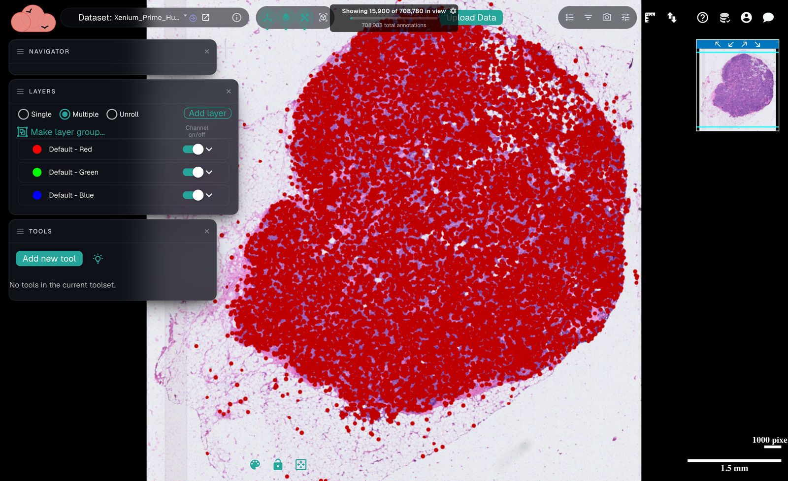

# Working with large annotation datasets

NimbusImage can visualize very large annotation datasets — hundreds of thousands, or even millions, of objects — while staying responsive. This is especially useful for spatial data (for example, Xenium datasets with hundreds of thousands of cells).

<figure><figcaption>
A Xenium H&#x26;E slide with nearly 709,000 cell annotations. The indicator at the top ("Showing 15,900 of 708,780 in view") reflects the lazy-loading described below — only a subset is drawn at a time to keep navigation smooth.
</figcaption></figure>


This works automatically. You don't need to turn anything on: NimbusImage detects when a dataset is large and switches to the lazy-loading behavior described below. Smaller datasets behave exactly as before, loading every object fully at every zoom level.


## How lazy loading works

To stay fast with huge numbers of objects, NimbusImage avoids loading everything at once. Instead, it loads and draws only what you need to see:

* **Stubs load first.** Each annotation initially loads as a lightweight "stub" — its position and metadata, but not its full outline coordinates. Loading stubs is fast even for very large datasets.
* **Shapes fill in on demand.** As you view an area, NimbusImage fetches the full coordinates ("hydrates") for the objects in your viewport, prioritizing larger objects and anything you've selected.
* **Dots stand in for shapes.** When more objects are in view than can be drawn as full outlines, the extras appear as small dots so you can still see where everything is. Zoom in and the outlines fill in as fewer objects compete for the budget.
* **Panning and zooming load more.** As you navigate, NimbusImage loads detail for the newly visible area and keeps a cache of recently seen shapes, so revisiting an area is instant.

The result is that scrolling, zooming, and panning stay smooth even on datasets that would previously have been too large to open comfortably.

## The object list for large datasets

The [Annotation List](interacting-with-objects.md#annotation-list) adapts to dataset size:

* For datasets below a threshold, the list works entirely in your browser, exactly as before.
* For larger datasets, filtering, sorting, and pagination happen **on the server**, so the list stays fast even with hundreds of thousands of objects. Property-value filters are also applied server-side.


In server-side mode, changing a filter returns the list to the first page.


## Advanced settings for large numbers of annotations

The defaults suit most datasets, but power users can tune the lazy-loading behavior. Open the **Settings** panel and expand **"Advanced settings for large numbers of annotations."**


Showing more annotations at once makes panning large datasets slower. Increase these limits gradually. Each setting has an allowed range; if you enter a value outside it (or one that conflicts with another setting), NimbusImage snaps it to a legal value and briefly shows an "Adjusted to …" note.


* **Stub mode threshold** (default: 100,000; range: 1,000–200,000) — The dataset annotation count above which stub-only (lazy) mode activates: stubs load first, and coordinates and property values load on demand. Independent of the render budget below.
* **Max visible annotations** (default: 50,000; range: 1,000–200,000) — The maximum number of annotations drawn per frame (as dots or shapes). This is also the size gate: datasets at or below this value render fully at every zoom. Higher values show more at once but make panning large datasets slower.
* **Max hydrated annotations** (default: 20,000; range: 500–200,000) — The maximum number of annotations drawn as full shapes per refresh; the rest show as dots. Cannot exceed **Max visible annotations**.
* **Hydration cache cap** (default: 40,000; range: 500–200,000) — The total cap on cached full-shape annotations. The cache accumulates across pans and zooms; least-recently-used shapes are evicted once the cap is exceeded (selected objects are protected until the selection alone exceeds the cap). Cannot be below **Max hydrated annotations**.
* **Zoomed-out coverage target** (default: 0.3; range: 0.01–1) — The fraction of the screen that rendered dots may cover when fully zoomed out (only for datasets larger than the render cap). Lower values give a sparser, cleaner overview. The budget doubles per zoom level up to the cap.
* **Viewport refresh threshold** (default: 0.2; range: 0.01–2) — How much the zoom or pan must change (for example, 0.2 = 20% of the viewport) before the view re-renders and re-hydrates. Higher values mean fewer refreshes and less loading churn while navigating.
* **Global threshold (all layers)** (default: on) — When on, the visibility threshold applies to the total number of annotations across all layers. When off, each layer is checked independently.
