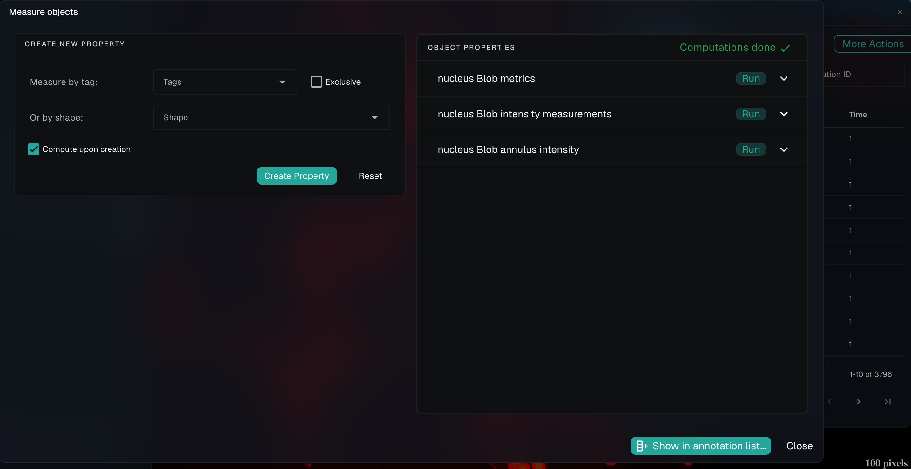
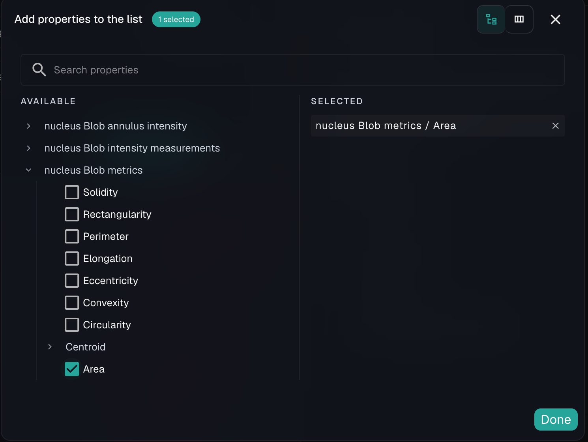
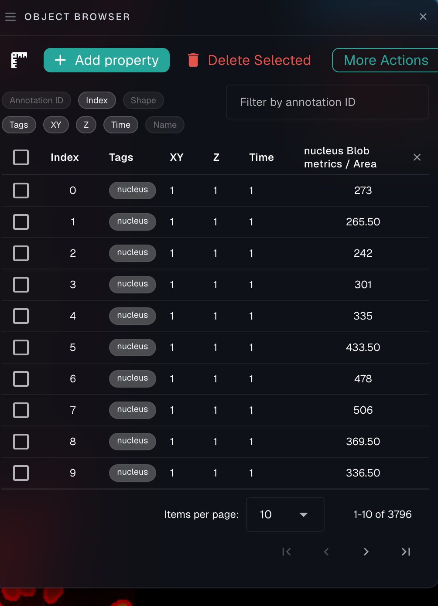
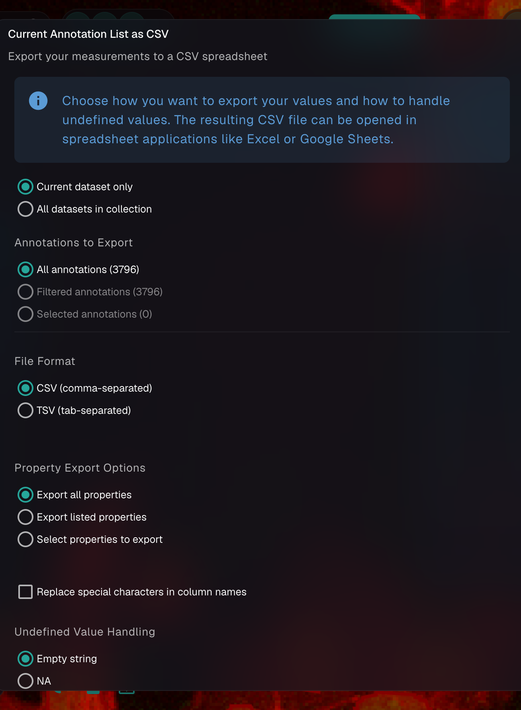

# Measuring object properties

Ultimately, most researchers want to extract numbers from their image data. These could correspond to fluorescent intensity across cells, or number of cells per colony, or density of filaments per region. NimbusImage allows you to make these computations easily by defining **properties**. A property (think: area) can be associated with an object and listed and exported for plotting and analysis. You can easily compute a lot of different properties using NimbusImage out of the box because of the flexibility that its tagging and connection system allows. For instance, if you want to find the count the number of spots connected to the basement membrane, that is easy to do with just a few clicks.

First, open the **Object List** and click the blue **"Measure objects"** button. This brings up the Measure objects panel:

<figure><figcaption>
Create new properties on the left; the properties already computed for your objects are listed on the right
</figcaption></figure>

In the **Create New Property** section, choose the **tag** of the objects you want to quantify (for example, `nucleus`) — or select a shape — and click **"Create Property"**. NimbusImage runs the appropriate property worker, and when it finishes the new measurements appear under **Object Properties** on the right (here, "nucleus Blob metrics", "nucleus Blob intensity measurements", and "nucleus Blob annulus intensity").

To display specific values, click **"Show in annotation list…"**, expand the property (e.g. "nucleus Blob metrics"), and check the metrics you want, such as **Area**:

<figure><figcaption>
Choose which computed metrics to show in the annotation list
</figcaption></figure>

The selected property now shows up as a column in the annotation list:

<figure><figcaption>
The Area property listed alongside each object
</figcaption></figure>

You can also press **"t"** while viewing the image to overlay the property values directly on the objects. When you're ready to analyze the numbers elsewhere, export them to a CSV (or TSV) from the **Import / export data** menu → **Export CSV**:

<figure><figcaption>
The CSV export dialog lets you choose scope, format, which properties to include, and how to handle missing values
</figcaption></figure>

## Blob metrics (area, perimeter, etc.)

The Blob Metrics property worker calculates a comprehensive set of morphological measurements for blob-shaped (polygon) objects in your dataset. This is particularly useful for analyzing cell shapes, nuclei, or any other blob-like structures you've annotated.

### Available metrics:

* **Area**: The total area enclosed by the object (in square pixels or physical units)
* **Perimeter**: The length of the object's boundary (in pixels or physical units)
* **Centroid**: The geometric center (x,y coordinates) of the object
* **Elongation**: Measures how stretched out the object is (value between 0-1, where 1 is maximally elongated)
* **Convexity**: Ratio of the object's area to the area of its convex hull (measures how convex vs. concave the shape is)
* **Solidity**: Ratio of the object's perimeter to the perimeter of its convex hull
* **Rectangularity**: How well the object fits within its minimum bounding rectangle
* **Circularity**: How closely the object resembles a perfect circle (4π × Area/Perimeter²)
* **Eccentricity**: Measures how much the object deviates from being circular (value between 0-1, where 0 is a circle)

### How to use:

1. Create blob objects in your image (manually or using automated tools)
2. Tag these objects appropriately (e.g., `nucleus`, `cell`, etc.)
3. Create a new property using the Blob Metrics worker
4. Select which tags to analyze
5. Choose whether to use physical units (μm, mm, etc.) or pixel units
6. Run the property worker to calculate metrics for all matching objects

### Physical units:

When the "Use physical units" option is enabled, all measurements will be converted from pixels to the selected physical unit (μm, mm, m, or nm) based on the pixel size metadata in your image. This allows for consistent measurements across datasets with different magnifications or resolutions.

This property is useful for:

* Measuring and comparing cell or organelle sizes
* Analyzing shape changes in response to treatments
* Quantifying morphological differences between cell types
* Correlating shape features with biological function

### Best practices for intensity measurements:

1. **Background correction**: Consider using background subtraction before measuring intensities for more accurate results
2. **Consistent exposure**: For comparative studies, ensure all images were acquired with the same exposure settings
3. **Channel selection**: Carefully select which channel to measure based on your experimental design
4. **Annulus size**: When using annular measurements, adjust the radius to match the biological structure you're analyzing (e.g., typical cytoplasm width)
5. **Validation**: Visually verify that your measurements align with the visible intensity patterns in your images

## Blob Intensity

The Blob Intensity property worker calculates pixel intensity statistics inside blob-shaped (polygon) objects in your dataset. This is ideal for measuring fluorescence within cells, nuclei, or other structures you've annotated.

### Available metrics:

* **Mean Intensity**: The average pixel intensity within the object
* **Max Intensity**: The brightest pixel value within the object
* **Min Intensity**: The dimmest pixel value within the object
* **Median Intensity**: The median pixel value (50th percentile)
* **25th Percentile Intensity**: The intensity value below which 25% of pixels fall
* **75th Percentile Intensity**: The intensity value below which 75% of pixels fall
* **Total Intensity**: The sum of all pixel intensities within the object

### How to use:

1. Create blob objects in your image (manually or using automated tools)
2. Tag these objects appropriately (e.g., `nucleus`, `cell`, etc.)
3. Create a new property using the Blob Intensity worker
4. Select the channel you want to measure intensity from (this can be different from the layer where annotations are drawn)
5. Run the property worker to calculate intensity metrics for all matching objects

### Applications:

* Quantifying protein expression levels within cells
* Measuring nuclear vs. cytoplasmic signal ratios
* Comparing fluorescence intensities between experimental conditions
* Identifying cells with high or low expression of a marker

## Blob Intensity Percentile

This worker extends the basic intensity analysis by allowing you to specify exactly which percentile to measure, giving you more flexibility for your specific analysis needs.

### Parameters:

* **Channel**: The image channel to measure intensity from. Note that this can be different from the channel where annotations are drawn. So you can calculate, e.g., the RFP intensity in objects defined by the DAPI channel to calculate nuclear RFP intensity.
* **Percentile**: A value between 0 and 99.99999 to specify which percentile intensity to calculate (default: 50)

### Output:

* **Nth Percentile Intensity**: The intensity value at your specified percentile

### When to use:

* When you need to focus on a specific portion of the intensity distribution
* For filtering out outliers (using high or low percentiles)
* When the median (50th percentile) doesn't fully capture the intensity characteristics you're interested in

## Blob Annulus Intensity

The Blob Annulus Intensity worker measures pixel intensity in a ring-shaped region around each blob object. This is particularly valuable for quantifying cytoplasmic signals around nuclei or membrane markers surrounding cells.

### Parameters:

* **Channel**: The image channel to measure intensity from
* **Radius**: The width of the annular region in pixels (default: 10)

### Available metrics:

* **Mean Intensity**: The average pixel intensity within the annular region
* **Max Intensity**: The brightest pixel value within the annular region
* **Min Intensity**: The dimmest pixel value within the annular region
* **Median Intensity**: The median pixel value in the annular region
* **25th Percentile Intensity**: The intensity value below which 25% of pixels fall
* **75th Percentile Intensity**: The intensity value below which 75% of pixels fall
* **Total Intensity**: The sum of all pixel intensities within the annular region

### Applications:

* Measuring cytoplasmic fluorescence around nuclear objects
* Quantifying membrane-associated markers surrounding cells
* Analyzing protein localization patterns at cell boundaries
* Studying gradient distributions of signals around organelles

## Blob Annulus Intensity Percentile

This worker combines the flexibility of percentile selection with annular region measurement, allowing for precise control over which statistical metric to use in your ring-shaped regions of interest.

### Parameters:

* **Channel**: The image channel to measure intensity from
* **Radius**: The width of the annular region in pixels (default: 10)
* **Percentile**: A value between 0 and 99.99999 to specify which percentile intensity to calculate (default: 50)

### Output:

* **Nth Percentile Intensity**: The intensity value at your specified percentile within the annular region
