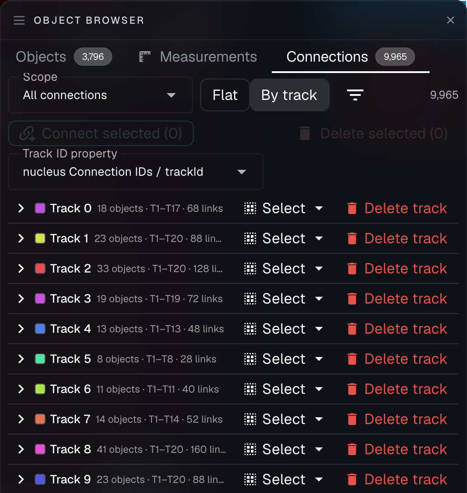

# Tools for connecting objects

In many cases, you may want to connect objects together, for instance, the same cell through a time lapse video, or spots to a nucleus. These connections can be made manually using connection tools such as Lasso connect or also automated connection algorithms such as Connect to Nearest. Connections can also be deleted manually. These connections can also sometimes be made when a property is computed to show you what objects were used in the computation.

## Best practices for connections

* **Use tags effectively**: Properly tagging your objects makes connection tools more precise
* **Assign hotkeys**: Set up hotkeys for your most frequently used connection tools
* **Think about directionality**: Remember that connections have direction (parent to child) which can be important for certain analyses

Connections form the foundation for many powerful analyses in NimbusImage, enabling you to quantify relationships between objects and trace structures across time.

## Manual connection tools: click and lasso connect

NimbusImage provides several intuitive tools for manually creating and removing connections between objects:

### Click connect

The **Click connect** tool allows you to create connections between objects by simply clicking them in sequence:

1. First, click on a "parent" object
2. Next, click on a "child" object
3. A connection will be established from the parent to the child

This tool is ideal for precisely connecting specific objects, like linking individual RNA spots to their corresponding cells or connecting organelles to their parent structures.

**Configuration options:**

* **Parent Annotation Tags**: Filter which types of objects can be selected as parents
* **Child Annotation Tags**: Filter which types of objects can be selected as children
* **Filter by layer**: Optionally restrict selections to objects on specific layers

### Lasso connect

The **Lasso connect** tool allows you to quickly connect multiple objects at once:

1. Draw a lasso around all the objects you want to connect
2. NimbusImage will automatically establish connections between the selected objects

This is particularly useful for:

* Connecting multiple spots to a cell at once
* Connecting sequential points in a time-lapse track
* Creating connections between groups of related objects

In time-lapse mode, the Lasso connect tool will intelligently connect objects sequentially by time point, making it extremely valuable for track creation and repair.

### Click disconnect

The **Click disconnect** tool allows you to remove individual connections:

1. Click on a connected parent object
2. Click on its connected child object
3. The connection between them will be removed

This is useful for removing incorrect connections without affecting other valid connections.

### Lasso disconnect

The **Lasso disconnect** tool allows you to quickly remove multiple connections at once:

1. Draw a lasso around the connected objects
2. All connections between objects within the lasso will be removed

This is particularly helpful when you need to clear all connections in a region and rebuild them correctly.

## Automated connection tools

NimbusImage provides powerful automated tools that can establish connections between objects based on various criteria, saving you considerable time compared to manual connections.

### Connect to nearest

The **Connect to nearest** tool automatically connects objects based on spatial proximity:

1. Each object with the "parent" tag will be connected to its nearest object(s) with the "child" tag
2. The connections are established based on configurable distance and relationship criteria

**Configuration options:**

* **Parent tag**: Tag that identifies which objects will serve as parents in the connections
* **Child tag**: Tag that identifies which objects will serve as children in the connections
* **Connect across Z**: When enabled, allows connections between objects on different Z-slices
* **Connect across T**: When enabled, allows connections between objects at different time points
* **Connect to closest centroid or edge**: Choose whether to measure distance from:
  * **Centroid**: The central point of each object (faster, simpler)
  * **Edge**: The boundary of each object (more precise for irregularly shaped objects)
* **Restrict connection**: Apply additional constraints to connections:
  * **None**: Connect based solely on distance
  * **Touching parent**: Only connect children that physically touch their parent
  * **Within parent**: Only connect children that are completely contained within their parent
* **Max distance (pixels)**: The maximum allowed distance between parent and child objects
* **Connect up to N children**: Limit the number of children that can connect to each parent

This tool is particularly useful for:

* Connecting RNA spots to their nearest nucleus
* Assigning cells to their closest blood vessel
* Connecting subcellular structures to their parent cells
* Efficiently processing large datasets with many objects

### Connect timelapse

The **Connect timelapse** tool specializes in automatically tracking objects across sequential time points:

1. Objects with the same tag are connected from one time frame to the next
2. Connections are established based on spatial proximity between frames
3. The algorithm intelligently handles object movement between frames

This is especially valuable for cell tracking, particle movement analysis, and other time-dependent studies.

**Configuration options:**

* **Object to connect tag**: Specifies which objects to track across time points (all objects with this tag will be connected)
* **Connect across gaps**: Allows connecting objects even when there are missing time points
  * Set a value from 0-10 to determine how many time points can be skipped
  * For example, a value of 1 would connect an object at t=5 directly to t=7 if t=6 is missing
* **Max distance**: The maximum pixel distance objects can move between frames and still be considered the same object
  * Set this based on how much your objects typically move between frames
  * Lower values (5-20 pixels) work well for slow-moving objects
  * Higher values may be needed for rapidly moving objects or lower frame rates

**How it works:**

1. The algorithm processes each spatial location (XY, Z) separately
2. For each time point, it searches for the closest matching objects in subsequent time points
3. Connections are created from later time points to earlier ones (children to parents)
4. All connections are automatically tagged with "Time lapse connection" for easy identification

This tool is perfect for:

* Automatically generating cell lineage trees
* Tracking particle movement over time
* Analyzing cell migration patterns
* Measuring growth or movement rates

**Best practices:**

* Start with a small max distance (10-20 pixels) and increase if needed
* Use the "Connect across gaps" feature when you have intermittently missing objects. These can be later fixed manually using [Time lapse mode](../time-lapse-mode.md)
* When tracking dividing cells, use this tool first, then manually correct division events
* Review tracks in Time lapse mode to identify and fix any tracking errors
* For very dense or challenging datasets, consider tracking a subset of objects first

After running the Connect timelapse tool, you can use the Time lapse mode (discussed in the [Time lapse mode](../time-lapse-mode.md) section) to visualize, review, and manually correct the resulting tracks.

## Browsing and editing connections

Once you have connections, the **Connections** tab in the Object Browser lets you see exactly what is connected to what, and clean up whatever is wrong — without hunting through the image for it.

<figure><figcaption>
The Connections tab in by-track view. Each track shows a color swatch matching the line drawn in the viewer, its size, and Select / Delete track actions. Here the tracks are titled by a computed <code>trackId</code> property.
</figcaption></figure>

### Two views of your connections

The **Flat** view lists individual parent-to-child links; the **By track** view groups them into tracks, where a track is a chain of connections following one object through time. By track is the natural view for time-lapse data; the flat list is more useful for spot-to-cell style connections.

A **Scope** selector controls which connections the tab shows:

* **All connections** in the dataset
* **Current location** — only connections at the XY position, Z slice, and time point you're viewing
* **Selected objects** — only connections involving objects you've selected
* **Passing filters** — only connections whose objects survive your current filters

### Deleting connections

From the Connections tab you can delete a single link, an entire track at once (**Delete track**), or every connection currently selected (**Delete selected**). This makes it practical to fix a tracking run that went wrong in one region without discarding the whole thing. Each track row also has a **Select** action that selects that track's objects in the viewer.

You can also **click connection lines directly in the viewer** — in both normal and time-lapse mode — so if you can see a bad link, you can cut it exactly where you see the problem rather than searching for it in a list.

### Connecting selected objects

The **Connect selected** action chains the objects you currently have selected into connections, in ascending time order. This is a quick way to build or repair a track from objects you've already picked out.

### Labeling tracks with a computed track ID

By default, the by-track view titles each track with a short internal identifier. If you have run the **Parent-Child Connection IDs** property worker, that worker assigns each track a numeric `trackId` — and that is the number that shows up in your exported CSV. To make the panel agree with your exports, use the **Track ID property** select in the by-track view and pick the computed property path (for example, `nucleus Connection IDs / trackId`). Each track is then titled with that value — `Track 42` — with the short internal id moved into the tooltip.

Because the worker assigned those ids against the connection graph as it existed when the property was computed, tracks whose connections have changed since then get a badge:

* **partial** — the track has members the property never covered, so objects were added after the worker ran
* **mixed IDs** — the track's members carry different ids, meaning two previously separate tracks have since been joined
* **no ID** — none of the track's members have a value

These badges are useful in their own right: they point at exactly the tracks whose connectivity changed after your last property computation, which are usually the ones worth reviewing. Re-running the property clears them.

### Filtering by track metrics

The **Track filters** menu — the filter icon beside the Flat / By track toggle — applies minimum and maximum bounds to three track metrics:

* **Connections in track** — how many links the track contains
* **Objects in track** — how many objects the track passes through
* **Duration (timepoints)** — how long the track spans in time

This is the fastest way to find the tracks worth your attention: set a minimum duration to isolate long-lived cells, or a maximum to surface the short fragments that usually indicate a tracking failure.

A connection whose track falls outside an active bound disappears from the list **and** from the image — both the connection lines in normal mode and the tracks in time-lapse mode. While a filter is narrowing, the count reads "N of M", the filter button carries a badge, and the empty state tells you the track filters are responsible rather than implying the dataset is empty.


Track metrics are always computed over the **whole track**, even when the scope selector is showing you only a fragment of it. A track that spans 100 time points is judged on all 100, not on the handful visible at your current location.


Track filters are view state for the current session, and they reset when you switch datasets — numeric bounds from one dataset rarely mean the same thing in another.

**Also hide these tracks' objects in the image** is an off-by-default checkbox in the same menu. With it on, the filtered-out tracks' objects are hidden too, not just their connection lines — useful for decluttering a dense field down to the tracks you care about. This is purely a display setting: the hidden objects still appear in the Objects tab, in exports, and in analysis. Objects that aren't part of any track are never hidden by it.

### Cleaning up dangling connections

Over the life of a dataset, connections can end up pointing at objects that have since been deleted. These "dangling" connections do nothing useful but still count toward your totals and track metrics.

When NimbusImage finds any, the Connections tab shows a row offering to delete them across the whole dataset. It reports the live count, asks for confirmation first, and the deletion can be undone. On a dataset with no dangling connections the row doesn't appear at all.