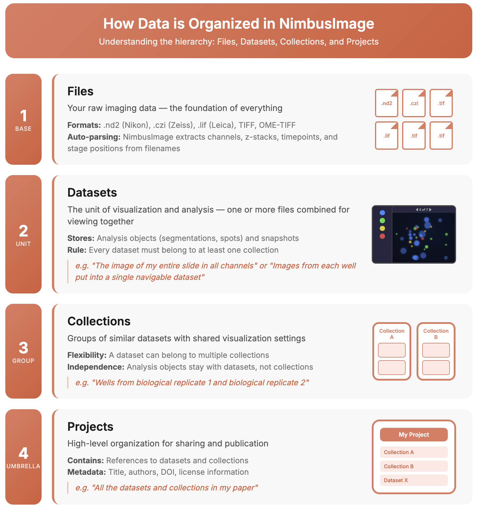

# Images, datasets, and collections

Imaging data in NimbusImage is organized into _datasets,_ _collections_, and _projects._

<div align="left"><figure><figcaption></figcaption></figure></div>

## Datasets

A _dataset_ is the set of images that you want to visualize and analyze at once. Examples could include:

1. A simple image.
2. A very large image.
3. A Nikon .nd2 file containing a Z-stack for 3 fluorescence channels.
4. A Nikon .nd2 file containing 15 positions of Z-stacks for 3 fluorescence channels.
5. Large images in 4 channels from a 12 well plate stored across multiple TIFF files.
6. Time lapse image data across a set of files.

A dataset can be from a single file (such as a multidimensional .nd2 file) or could be spread across multiple files. The dataset will also store all objects and snapshots that you make as you analyze your data. To learn more about file formats, see [File formats](../documentation/file-formats.md).


Datasets are stored on the server as a folder that contains (often multiple) files.


## Collections

A _collection_ is a set of datasets that you want to group together for visualization and analysis. For instance, if you collected data from, say, a number of experimental conditions over multiple days, then you may want to group those datasets for each experimental condition into a collection.

The advantage of organizing datasets into a collection is that the user interface is common across all datasets in the collection. Let's say you set up just the right set of contrast settings, colors, and tools for one dataset and now you want to use those same settings for another dataset. In a collection, those settings will apply across _all_ datasets, simplifying that process.

In order to form a collection, the datasets must be _compatible_ in the sense that the datasets have a similar structure. For instance, if one dataset is a time lapse with 2 fluorescence channels and the other is a Z-stack with 3 channels, then they will not be compatible. However, they don't have to have the exact same size. For instance, say you took 15 timepoints for your time lapse recording in condition 1, but 20 timepoints for condition 2. Those are still compatible as a collection.


**Every dataset belongs to a collection.** If you never use collections, that is totally fine, but just be aware that somewhere in there, there is a collection that contains your dataset.



**A dataset can belong to multiple collections.** Each collection can provide a different view of the same dataset, because it could have different visualization settings and annotation tools. _However, note that objects are associated with the dataset itself and not the collection._


## Projects

A _project_ is a way to group datasets and collections together for coordinated management and sharing. Projects are particularly useful for organizing data associated with a publication or a complete study.

Key features of projects:

* Group multiple datasets and collections into a single organizational unit
* Add publication metadata including title, description, license, keywords, authors, and DOI
* Prepare datasets for future export to repositories like Zenodo
* Track project status (draft, exporting, exported)

Projects exist as organizational containers that reference your datasets and collections—the underlying data stays where it is, but projects give you a unified way to manage and eventually share a complete body of work.

## Uploading a dataset

There are two ways to upload a dataset.

**Quick Import:** Just drop in your data on the home page and NimbusImage will automatically parse your data, pick some default options, and bring you to the viewer! Note that behind the scenes, NimbusImage makes a collection for your dataset.

**Advanced Import:** For more control over how your image files are parsed into datasets and organized into collections, use Advanced Upload.

### Uploading multiple files at once

NimbusImage supports batch uploading, which allows you to upload multiple files at once and create a collection containing one dataset per file. This is useful when you have many separate image files that you want to organize together.

* **Quick Import:** Drop multiple files at once, and each file will become its own dataset, all organized into a single collection with default settings.
* **Advanced Import:** Upload multiple files and configure them as a batch. You set the dimension configuration (variables, compositing, etc.) once on the first dataset, and NimbusImage applies those same settings to all subsequent datasets in the batch. This saves time when you have many files with the same structure.

First, upload files, name the dataset, and choose the location for the dataset files to be stored.

**Variable assignment:** The next step in advanced upload is variable assignment: when you have a Z-stack and stage positions and timepoints, each of those is a variable that NimbusImage will let you navigate. Some files, such as .nd2 files or TIFF files with sufficient specification, contain a lot of metadata and the variable assignment is already done. However, it is quite common for data to be stored across multiple files, with the variable encoded in the filename. For instance:

```
GFP_s001_t001.tif
GFP_s001_t002.tif
...
RFP_s003_t010.tif
```

In the above, there could be two channel variables (GFP, RFP), 3 stage positions, and 10 timepoints. **NimbusImage will automatically attempt to read these filename variables and assign them.** In the above, it will assign the variable with "s" to XY position and "t" to time and GFP/RFP to channel. Moreover, sometimes the .tif file itself will have multiple images in it. In that case, that series of images can also be assigned to a variable. **NimbusImage will let you change the variable assignment**, giving you complete flexibility over how all these variables are parsed.

**Compositing:** Sometimes, you want stage position to be a variable you can flip through, like different wells in an image. By default, those will be parsed as different XY positions that can be scrolled through as a variable. However, sometimes you might have images that tile a large field of view, or perhaps you want to visualize all the wells next to each other. In that case, check "Composite", which will put all the data into a single large image using the metadata about the location of the different stage positions.

**Transcoding into optimized TIFF:** In order to facilitate the ability to navigate large images with high performance, it is important to have a well-optimized file format. We have found that many microscopy formats are unfortunately very inefficient. Hence, we give the option to transcode all the data into a single, well-optimized TIFF file. This transcoding takes some compute time, but results in much better performance in most scenarios, hence it is enabled by default. Some formats, like .nd2, are well optimized from the outset, and so transcoding is not enabled by default for those files.

**Assigning to a collection:** In the next screen, you can decide how you want to organize your dataset into a collection. The default is to create a new collection. However, you can also choose to add it to an existing collection or make a new collection derived from an existing collection. The latter option makes a copy of an existing collection and puts your file in this copied collection. That is useful if you want to, say, copy over existing viewer settings, but you want to organize this dataset separately.
