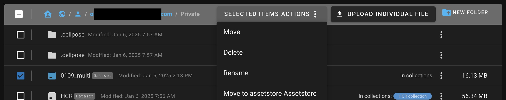

# Managing files

## Overview

NimbusImage provides a powerful file management system that helps you organize your datasets, collections, and other files. The interface is designed to be intuitive while giving you full control over your data organization.

<figure><figcaption>
NimbusImage dataset manager interface
</figcaption></figure>

## The landing screen

When you first log in, you'll see the main landing screen with several key sections:

1. **Upload dataset** - Options to add new data to NimbusImage
2. **Recent datasets** - Shows your recently accessed datasets
3. **File navigator** - Browse your folders and files
4. **Action buttons** - Create folders, upload files, and more


The file navigator shows your current location. Any datasets you upload will be placed in this current location unless specified otherwise.


## Uploading datasets

NimbusImage provides a unified "Create Dataset" dialog that offers both quick and advanced upload options. Before uploading, you'll need to specify where to store your dataset (Private, Public, or Team folder).

### Quick Upload

The Quick Upload option lets you:

* Simply drag and drop files directly
* Use default options for processing
* Go straight to the image viewer
* Have a collection automatically created with the same name

This is perfect for getting started quickly with minimal configuration.

### Advanced Upload

If you need more control over how your data is organized and processed, use Advanced Upload to:

* Customize variable assignments
* Configure tiling and compositing options
* Specify collection placement
* Adjust transcoding settings

## File organization

### Storage locations

NimbusImage provides specific locations for storing your datasets and files:

* **Private folder**: Only accessible to you
* **Public folder**: Accessible to everyone using the system
* **Team folder**: (NimbusImage.com specific) Shared only with members of your team

<figure><figcaption>
Private and public folders
</figcaption></figure>


By default, Quick Upload will place your dataset in your Private folder. This ensures your data remains private until you choose to share it.


### Creating folders

To organize your datasets, you can create folders within these storage locations:

1. Navigate to where you want to create the folder
2. Click the "NEW FOLDER" button in the top right
3. Name your folder and click "Create"

## File operations

### Basic file actions

You can perform several operations on your files and datasets:

<figure><figcaption>
Actions on files and datasets
</figcaption></figure>

* **Move**: Relocate files to a different folder
* **Delete**: Remove files or datasets
* **Rename**: Change the name of a file or dataset
* **Browse**: For datasets, view the internal files (use with caution)

### Working with multiple files

<figure><figcaption>
Actions on multiple items
</figcaption></figure>

To operate on multiple files at once:

1. Select the checkboxes next to the files
2. Click "SELECTED ITEMS ACTIONS"
3. Choose the operation you want to perform

### Individual file options

Each file or dataset has its own options menu (three dots) with specific actions:

* For regular files: Download, Move, Delete, etc.
* For datasets: Browse internal files (caution: these files are system files that generally should not be modified)


Dataset folders contain system files that NimbusImage uses to render and analyze your data. It's best not to directly modify these files unless you know exactly what you're doing.


## Sharing datasets and collections

NimbusImage allows you to share datasets and collections with other users for collaboration. This is useful when working with colleagues or sharing data with collaborators.

### How to share

To share a dataset or collection:

1. Click the sharing icon next to the dataset or collection you want to share
2. Enter the email address of the recipient's NimbusImage account
3. Choose the access level (Read or Write)
4. Click to confirm sharing

### Access levels

When sharing, you can grant two types of access:

* **Read access**: The recipient can view the dataset and any annotations, but cannot make changes
* **Write access**: The recipient can view and modify annotations and analysis

### Important considerations


To share a dataset, you must also share its parent collection so the recipient can view it properly. Without sharing the parent collection, the recipient won't be able to access the shared dataset.


### What happens when you share

Once you share a dataset or collection:

* The shared content automatically appears in the recipient's file navigator
* Any collaborative changes remain visible across all authorized users
* You can revoke access at any time through the sharing settings


Sharing is a powerful way to collaborate on analysis while maintaining control over who can access and modify your data.


## Team collaboration (NimbusImage.com only)

If you're using NimbusImage.com and are part of a team, you can access team-specific storage:

1. Navigate to the top level (globe icon)
2. Click the "Collections" icon
3. Select your team name
4. Upload or create datasets in this location to share only with team members

<figure><figcaption>
Selected items actions menu
</figcaption></figure>

<figure><figcaption>
File action menu
</figcaption></figure>


Team folders provide a convenient way to collaborate on datasets while keeping them separate from your personal files and fully public content.


## Best practices for file management

* **Use meaningful names** for your datasets and collections
* **Create folders** to organize related datasets
* **Keep the file structure simple** to make navigation easier
* **Use private folders** for work in progress
* **Move to team folders** when ready to collaborate

By effectively using NimbusImage's file management system, you can keep your datasets organized and easily accessible for analysis and collaboration.
