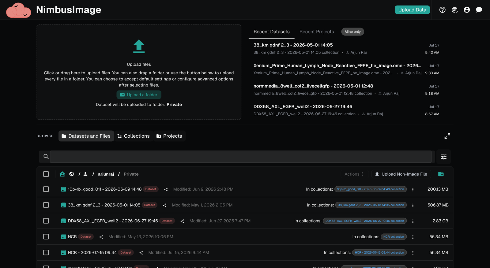
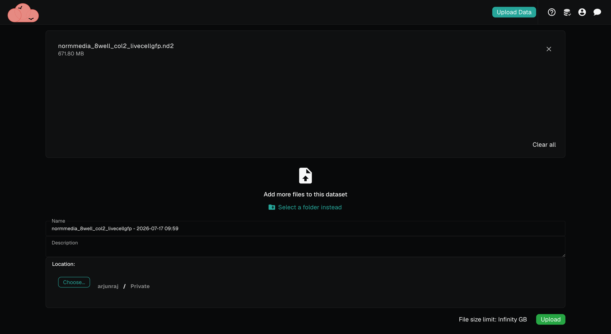
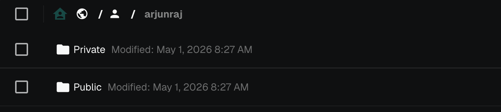
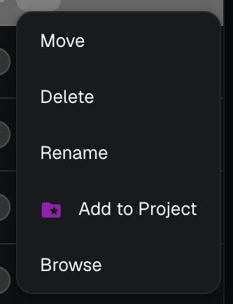
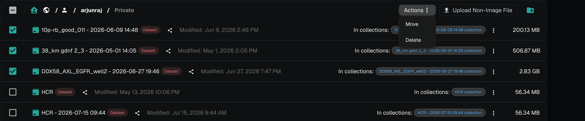
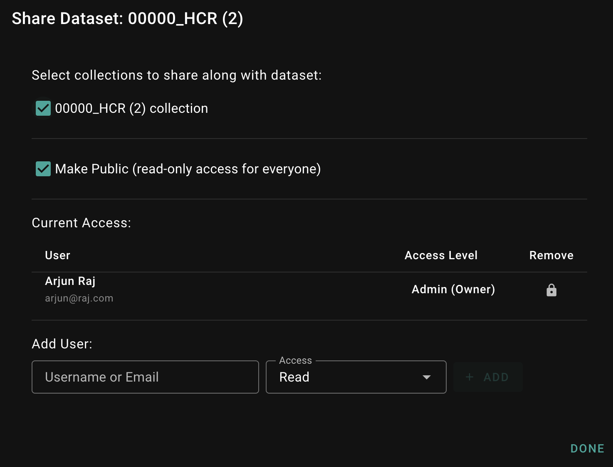

# Managing files

## Overview

NimbusImage provides a powerful file management system that helps you organize your datasets, collections, and other files. The interface is designed to be intuitive while giving you full control over your data organization.

<figure><figcaption></figcaption></figure>

## The landing screen

When you first log in, you'll see the main landing screen with several key sections:

1. **Upload dataset** - Options to add new data to NimbusImage
2. **Recent datasets** - Shows your recently accessed datasets
3. **File navigator** - Browse your folders and files
4. **Action buttons** - Create folders, upload files, and more


The file navigator shows your current location. Any datasets you upload will be placed in this current location unless specified otherwise.


## Uploading datasets

NimbusImage provides a unified "Create Dataset" dialog that offers both quick and advanced upload options. Before uploading, you'll need to specify where to store your dataset (Private, Public, or Team folder).

### Quick Upload

The Quick Upload option lets you:

* Simply drag and drop files directly
* Use default options for processing
* Go straight to the image viewer
* Have a collection automatically created with the same name

This is perfect for getting started quickly with minimal configuration.

### Advanced Upload

If you need more control over how your data is organized and processed, use Advanced Upload to:

* Customize variable assignments
* Configure tiling and compositing options
* Specify collection placement
* Adjust transcoding settings

<figure><figcaption><p>The Advanced Import screen, where you can review the selected files, name the dataset, choose a location, and add more files or a whole folder before importing</p></figcaption></figure>

### Uploading a folder

You can upload an entire folder at once instead of selecting files individually:

* **Drag and drop a folder** onto the upload area. Every file inside is collected, including files in nested subfolders.
* **Click "Upload a folder"** (or "Select a folder instead") to open a folder picker.

All of the folder's files are flattened into the dataset — the subfolder structure itself isn't preserved — which matches how NimbusImage builds a multi-file dataset. Files are added in natural, numeric-aware name order, so image sequences like `frame1`, `frame2`, … `frame10` are ordered correctly.

## File organization

### Storage locations

NimbusImage provides specific locations for storing your datasets and files:

* **Private folder**: Only accessible to you
* **Public folder**: Accessible to everyone using the system
* **Team folder**: (NimbusImage.com specific) Shared only with members of your team

<div align="left"><figure><figcaption><p>Private and public folders</p></figcaption></figure></div>


By default, Quick Upload will place your dataset in your Private folder. This ensures your data remains private until you choose to share it.


### Creating folders

To organize your datasets, you can create folders within these storage locations:

1. Navigate to where you want to create the folder
2. Click the "NEW FOLDER" button in the top right
3. Name your folder and click "Create"

## File operations

### Basic file actions

You can perform several operations on your files and datasets:

<div align="left"><figure><figcaption><p>Actions on files and datasets</p></figcaption></figure></div>

* **Move**: Relocate files to a different folder
* **Delete**: Remove files or datasets
* **Rename**: Change the name of a file or dataset
* **Browse**: For datasets, view the internal files (use with caution)

### Working with multiple files

<figure><figcaption></figcaption></figure>

To operate on multiple files at once:

1. Select the checkboxes next to the files
2. Click "ACTIONS"
3. Choose the operation you want to perform

### Individual file options

Each file or dataset has its own options menu (three dots) with specific actions:

* For regular files: Download, Move, Delete, etc.
* For datasets: Browse internal files (caution: these files are system files that generally should not be modified)


Dataset folders contain system files that NimbusImage uses to render and analyze your data. It's best not to directly modify these files unless you know exactly what you're doing.


## Sharing datasets and collections

NimbusImage provides flexible sharing options that allow you to share datasets and collections with specific users or make them publicly accessible to anyone.

### How to share with specific users

To share a dataset or collection with specific users:

1. Click the sharing icon next to the dataset or collection you want to share
2. Enter the email address of the recipient's NimbusImage account
3. Choose the access level (Read or Edit)
4. Click to confirm sharing

The sharing dialog shows a real-time table of all users who currently have access, their permission levels, and allows you to modify or remove access as needed.

### Access levels

When sharing, you can grant two types of access:

* **Read access**: The recipient can view the dataset and any annotations, but cannot make changes
* **Edit access**: The recipient can view and modify annotations and analysis


Dataset owners always retain full access and cannot be removed from the access list.


### Making a dataset public

You can make a dataset publicly accessible so that **anyone with the link can view it, even without a NimbusImage account**. This is useful for sharing data with collaborators who don't have accounts, for publications, or for sharing with the broader community.

To make a dataset public:

1. **Open the dataset** in the viewer
2. **Click the Share button** (the `<` icon next to the dataset name) to open the Share Dataset dialog

<div align="left"><figure><figcaption><p>The Share button next to the dataset name</p></figcaption></figure></div>

3. **Check the "Make Public" checkbox** — labeled "Make Public (read-only access for everyone)"

<div align="left"><figure><figcaption><p>The Share Dataset dialog with the Make Public option</p></figcaption></figure></div>

4. **Copy the URL** from your browser's address bar — this is the shareable link

To share the dataset, simply send this URL to anyone. When they open it, they will be able to view the dataset directly in the NimbusImage viewer without needing to log in or create an account.


For a public dataset, the shareable link is the same URL you see when viewing the dataset (the datasetView route) — just copy the URL from your browser and send it. If you'd rather not make the dataset public, create a [share link](#share-links-and-embed-links) instead.


#### What public viewers can see and do

Public viewers have **read-only access** to the dataset. They can:

* View the image data, navigate through Z-stacks, positions, and channels
* See any existing annotations (objects, connections, and properties)
* View snapshots

Public viewers **cannot** modify annotations, run analysis tools, or change any settings. Only users you have explicitly granted Edit access can make changes.


Making a dataset public means anyone with the link can view it. You can revoke public access at any time by unchecking "Make Public" in the sharing dialog.


### Share links and embed links

A **share link** gives anyone who has the URL a read-only view of one dataset in one collection, without making the dataset public and without requiring the recipient to have a NimbusImage account or sign in. Every share link also has an **embed** version that shows only the image viewer, with no toolbar or side panels, so you can place the view on another web page.

How share links compare with the other ways of sharing:

* **Sharing with specific users** gives named NimbusImage accounts Read or Edit access, and the dataset appears in their file navigator.
* **Making a dataset public** opens the dataset (and its collections) to everyone, read-only.
* **A share link** opens a single view of the dataset to whoever has that particular link, read-only. You can give each link an expiry date and revoke it at any time without affecting anyone else's access.

#### Creating a share link

Only the dataset's owner (or another user with admin access to it) sees the **Share links** section.

1. **Open the Share Dataset dialog** for the dataset (the Share button next to the dataset name in the viewer).
2. **Select exactly one collection** in "Select collections to share along with dataset". A link always opens the dataset in a single collection, with that collection's layers and settings, so the **Create** button is disabled until exactly one collection is checked.
3. In the **Share links** section, optionally enter a **Label** (for example, "Reviewer 2" or "Lab website") so you can tell your links apart later.
4. Choose when the link **Expires**: **7 days**, **30 days** (the default), **90 days**, or **Never**.
5. Click **Create**.

The new link appears in a green box, along with its **Embed (no toolbar)** version. Use the copy button to copy the link.


Copy the link (and the embed link, if you need it) right away — it is **shown only once**. If you lose it, create a new link and revoke the old one.


#### What recipients can and can't do

Someone who opens a share link sees the dataset in the NimbusImage viewer, with no sign-in required. They can:

* View the image data and navigate through Z-slices, time points, XY positions, and channels
* See the existing annotations (objects, connections, and properties)

They **cannot**:

* Modify annotations, run analysis tools, or change any settings — the link is read-only
* Download the underlying image files or export data through the link
* See any of your other datasets — the link opens only the one dataset and collection it was created for
* Create share links of their own

If the link has expired or been revoked, the recipient sees a "This link does not work" message instead of the dataset.


If the recipient is already signed in to NimbusImage in the same browser, opening a share link does not sign them out — their own session is restored when they leave the shared view.


#### Embedding a view on another web page

The **Embed (no toolbar)** link shows only the image canvas — the toolbar and side panels are hidden — which makes it suitable for placing a live, explorable view of your data on a lab website, a project page, or an online paper supplement. To embed it, use the embed link as the source of an `<iframe>` on your page, for example:

```html
<iframe src="PASTE-YOUR-EMBED-LINK-HERE" width="800" height="600"></iframe>
```

The embed link follows the same rules as the share link it came from: it is read-only, it expires when the share link expires, and revoking the share link also disables the embed.

#### Managing and revoking share links

The **Share links** section of the Share Dataset dialog lists the dataset's existing links with their **Label**, **Collection**, **Created** date, and **Expires** date ("never" for links without an expiry; expired links are marked "(expired)"). The link URLs themselves are not shown again in this list.

To disable a link, click **Revoke** next to it. Revoking takes effect immediately: the link is removed from the list, and both the share link and its embed version stop working for everyone who has them. Revoking one link does not affect any other links or any users you've shared the dataset with directly.

Deleting a dataset automatically revokes all of its share links.


Anyone who has a share link can view the dataset, so treat the link like a password: only send it to people you intend to see the data, prefer an expiry date over "Never" when you only need temporary access, use labels so you know who each link was for, and revoke links you no longer need. Remember that anything you embed on a public web page can be viewed by every visitor to that page.


### Important considerations


To share a dataset, you must also share its parent collection so the recipient can view it properly. Without sharing the parent collection, the recipient won't be able to access the shared dataset.


### What happens when you share

Once you share a dataset or collection:

* The shared content automatically appears in the recipient's file navigator
* Any collaborative changes remain visible across all authorized users
* You can revoke access at any time through the sharing settings
* For public datasets, anyone with the link can view the data immediately


Sharing is a powerful way to collaborate on analysis while maintaining control over who can access and modify your data.


## Team collaboration (NimbusImage.com only)

If you're using NimbusImage.com and are part of a team, you can access team-specific storage:

1. Navigate to the top level (globe icon)
2. Click the "Collections" icon
3. Select your team name
4. Upload or create datasets in this location to share only with team members

<div align="left"><figure><figcaption><p>Selected items actions menu</p></figcaption></figure></div>

<div align="left"><figure><figcaption><p>File action menu</p></figcaption></figure></div>


Team folders provide a convenient way to collaborate on datasets while keeping them separate from your personal files and fully public content.


## Best practices for file management

* **Use meaningful names** for your datasets and collections
* **Create folders** to organize related datasets
* **Keep the file structure simple** to make navigation easier
* **Use private folders** for work in progress
* **Move to team folders** when ready to collaborate

By effectively using NimbusImage's file management system, you can keep your datasets organized and easily accessible for analysis and collaboration.
