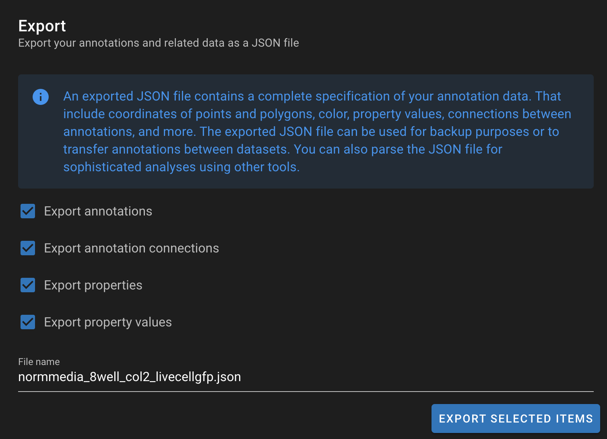

# Managing files

## Overview

NimbusImage has a document management system that allows you to manage your datasets, collections, and other files.

<figure><figcaption>
NimbusImage dataset manager
</figcaption></figure>
