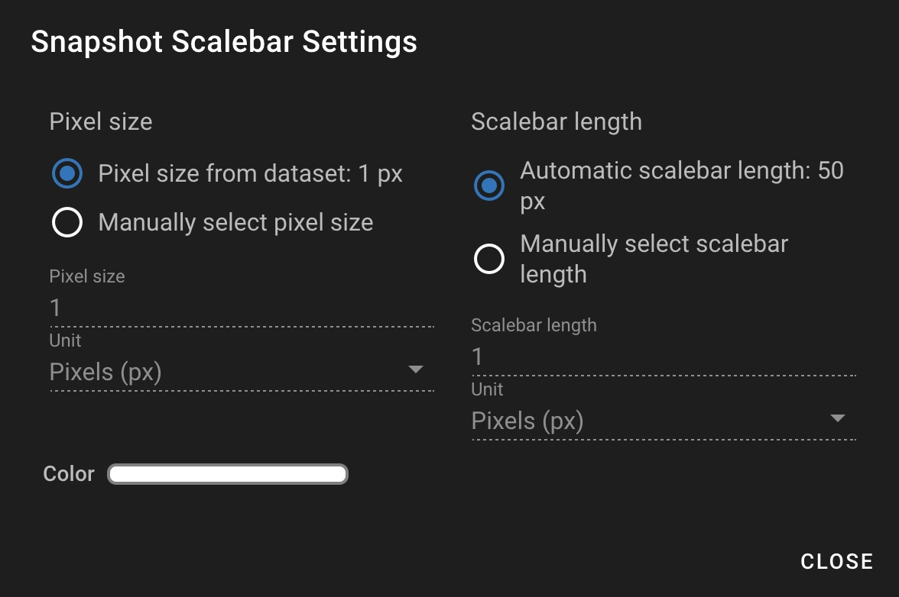
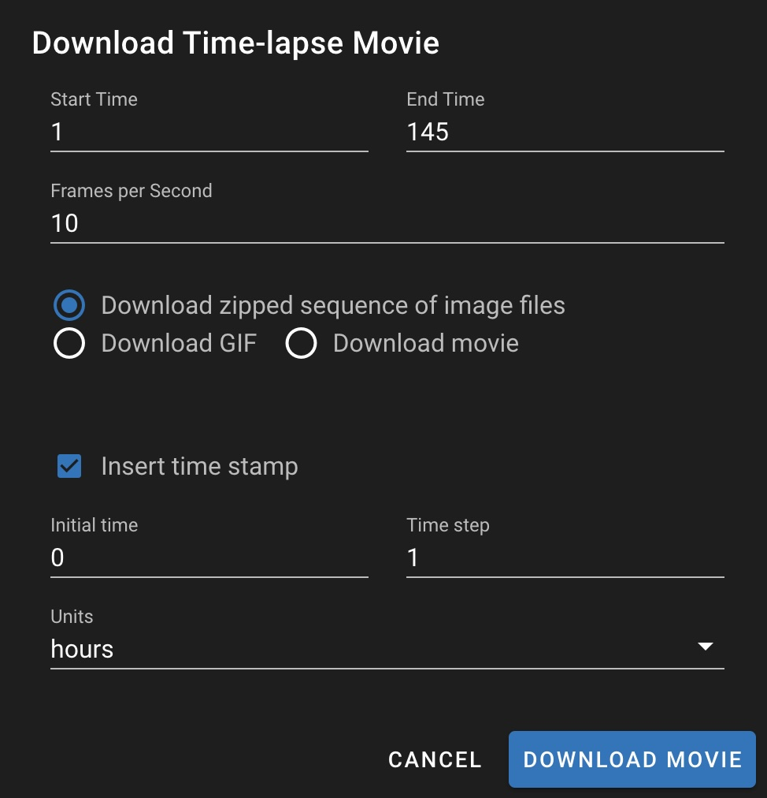

# Snapshots

Snapshots serve a few purposes:

1. Bookmark a location in your dataset to facilitate sharing.
2. Download images of specific regions for publication purposes.
3. Download movies from your dataset to make it easy to share these with people.

## Making a Snapshot

Making a snapshot is easy. Just open the Snapshot pane by clicking here.

Drag the red rectangle to cover the area of interest. The pixel-precise location area are also given in numerical fields, so you can make it precisely the size you would like. A couple convenience functions are there:

1. **Set frame to current viewport.** If you've zoomed into a place you like, then click this button and the frame of the Snapshot will be set to precisely the region you zoomed to.
2. **Set frame to maximum.** This button will reset the frame to contain the entire image in the view.

## Selecting multiple Snapshots

You can select multiple snapshots using checkboxes next to each snapshot in your snapshot list. This makes it easy to:

* Download images for multiple snapshots at once
* Delete multiple snapshots simultaneously
* Organize and manage your snapshot collection efficiently

Simply check the boxes next to the snapshots you want to work with, then choose the appropriate action from the available options.

## Downloading Images and Movies

### Image Download Options

<figure><figcaption>
Downloading options
</figcaption></figure>

There are multiple ways in which you can download Snapshot images for use in a publication or presentation.

**Scaled layers vs Raw channels.** You can either download contrasted images or raw pixel value images. Note that all contrasts are linear and hence allowed by most major journals.

**Format.** Select the desired file format for your downloaded images. PNG is the default option, which preserves image quality.

**Layer download options.** There are several ways you can download your images:

1. **Download images for current location.** Gives you images for the current snapshot location with these options:
   * _All layers._ Provides an image file for each layer separately.
   * _Composite layers._ Provides a composite image with all layers merged together, matching what is on screen.
   * _Individual layers._ Allows you to download an image just for the specific layer selected.
2. **Download images for all snapshots.** Applies the selected download options to all snapshots in your dataset.
3. **Download movie for current location.** Creates a movie from the current snapshot location.
4. **Download screenshot of current viewport.** Allows you to download a "screenshot" of exactly what you see on screen, including all annotations and the scale bar if enabled.

### Scale Bar Options

You can add a scale bar to your exported images by checking the "Add scalebar" option. Click the settings icon next to the scale bar option to customize:

<figure><figcaption></figcaption></figure>

**Pixel size options:**

* Use pixel size from dataset (based on pixel size reported in the microscope metadata)
* Manually select pixel size

**Scalebar length options:**

* Automatic scalebar length (automatically calculated to be optimal for most cases)
* Manually select scalebar length

You can also adjust the color of the scale bar using the color slider.

### Time-lapse Movie Options

When downloading a movie from your dataset, you have several options to customize:

<figure><figcaption></figcaption></figure>

**Time Range:**

* Start Time: The beginning frame number (default: 1)
* End Time: The final frame number

**Frames per Second:** Controls the playback speed of your movie (default: 10 fps)

**Download Format Options:**

* Download zipped sequence of image files (useful if you want to make a movie with some other software)
* Download GIF (useful for sharing on social media)
* Download movie (video file for presentations, WebM format)

**Time Stamp Options:**

* Insert time stamp: Adds a time indicator to each frame
* Initial time: Starting value for the time stamp (default: 0)
* Time step: Increment between frames (default: 1)
* Units: Time units to display (hours, minutes, seconds, etc.)

After configuring your settings, click "Download Movie" to generate and download your time-lapse movie.
