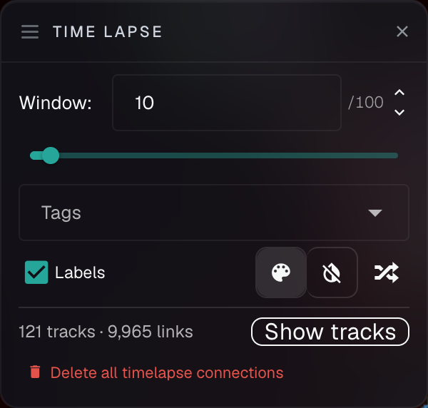
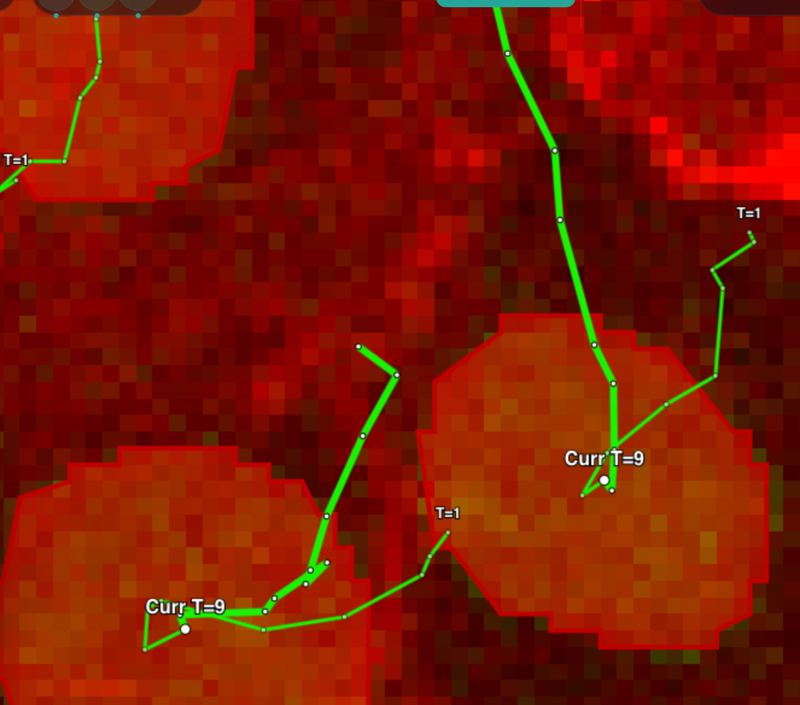

# Time lapse mode

Time lapse mode in NimbusImage provides powerful capabilities for tracking and analyzing objects across time points. This feature is particularly useful for cell tracking, movement analysis, and other time-dependent studies.

## Enabling Time lapse mode

When working with time lapse datasets, the Time lapse mode option automatically becomes available in the interface:

<figure><figcaption></figcaption></figure>

1. Look for the "Time lapse mode" checkbox in the variable navigation panel
2. Check the box to enable tracking visualization and special time lapse features

The "Time lapse mode" checkbox stays in the Navigator, but the controls themselves now live in their own **Time Lapse** palette next to it, rather than inside the Navigator — so turning the mode on doesn't push the Layers and Tools panels down the screen. Closing the palette turns the mode off.

The panel provides a **Window** slider, a **Tags** filter, a **Labels** toggle, track coloring controls, a live track count, and a **Delete all timelapse connections** button.

## Understanding tracks and connections

In Time lapse mode, objects are connected across time points to form "tracks" that represent the same biological entity (like a cell) over time.

### Visualizing tracks

Tracks appear as connected lines between objects across different time points:

<figure><figcaption>
Two tracked cells at the current time point ("Curr T=9"), each linked back through earlier frames to its start ("T=1")
</figcaption></figure>

Key features of track visualization:

* **Current time point**: The current time point is highlighted with "Curr T=X" label and typically appears larger
* **Connected objects**: All objects connected to the current object are shown as a track
* **Time labels**: Each object shows its time point (T=1, T=7, etc.). These labels are clickable to take you right to that time point.
* **Connection colors**:
  * **Colored connections**: Normal connections between consecutive time points. Each color represents a different track.
  * **Red connections**: Connections that skip time points (track connecting from e.g. t=8 to t=10)
  * **Line thickness**: Forward-in-time connections are thicker than backward-in-time connections

### Track window setting

The "Window" slider controls how many time points before and after the current time point are shown in the track visualization:

* Higher values show more of the track's history and future
* Lower values focus on just the immediate connections
* Adjust based on the density of your data and analysis needs

The tags field allows you to only do time-lapse analysis on a subset of objects defined by the specified tags.

Delete all timelapse connections will delete all connections made by the "Connect timelapse" tool and also the "Lasso connect".

### Track coloring

Three buttons next to the Labels toggle control how tracks are colored:

* **Give each track its own color** — makes it much easier to follow an individual track through a crowded field
* **Draw every track in one color** — renders every track white, often the clearer choice when many tracks overlap
* **Shuffle track colors** — re-rolls the assignment, which helps when two neighboring tracks happen to land on similar hues

### Track count and jumping to the Connections tab

A live **"N tracks · M links"** readout tells you how many tracks are currently drawn — in the panel above, 121 tracks across 9,965 links. The **Show tracks** button beside it opens the Object Browser straight into the [by-track connection view](analyzing-image-data-with-objects-connections-and-properties/tools-for-connecting-objects.md#browsing-and-editing-connections), where each track shows a color swatch matching the line drawn in the viewer, its size ("18 objects · T1–T17 · 68 links"), and **Select** and **Delete track** actions.

This makes the panel and the list two views of the same thing: spot a suspicious track in the image, click through to its row; or filter tracks by length in the list and watch the image narrow to match.

### Filtering which tracks are drawn

The **Track filters** in the Connections tab — bounds on connections per track, objects per track, and duration in time points — apply to the tracks drawn here as well. Setting a minimum duration is an effective way to clear short, spurious fragments out of the view so you can concentrate on the tracks that persist. See [Filtering by track metrics](analyzing-image-data-with-objects-connections-and-properties/tools-for-connecting-objects.md#filtering-by-track-metrics).


Time lapse mode stays responsive on datasets with very large numbers of connections — tens of thousands of links across thousands of objects. Scrubbing through time redraws only the tracks that actually changed rather than rebuilding the whole layer.


## Creating and editing tracks

### Using Connect timelapse tool

NimbusImage provides a dedicated tool for connecting objects across time:

Key settings:

* **Object to connect tag**: Select which type of objects to connect (based on their tags)
* **Connect across gaps**: Allows connecting objects even when there are missing time points
* **Max distance**: Maximum pixel distance between objects in consecutive frames to be considered for connection

To use the tool:

1. Create the Tool from the toolset menu
2. Configure the settings
3. Click "COMPUTE" to automatically connect objects based on proximity and settings

### Using Lasso connect for manual tracking

One of the most powerful features is the ability to use a lasso tool to manually define tracks:

1. Create a lasso connect tool from the toolset menu
2. Draw a lasso around the objects you want to connect across time
3. NimbusImage will **automatically connect them sequentially by time point**

This feature is particularly helpful for:

* Connecting "orphaned" objects to existing tracks
* Creating new tracks from scratch
* Fixing tracking errors where automatic tracking failed

Here's an example of connecting up an "orphan" cell at t=8 (orphans are in gray). The track is connected up until t=7 and from t=9 onwards, but sometimes you get a gap in the track because of a missed cell segmentation. Here, we drew in the missing cell manually, but then you want to connect up the track:

<figure><figcaption></figcaption></figure>

Using "Lasso connect", you can just circle (sloppily) all the points in the track, and it will "auto-magically" connect the tracks up sequentially:

<figure><figcaption></figcaption></figure>

### Cutting a track where you see the problem

Connection lines drawn in the viewer are clickable, so when a track visibly jumps to the wrong cell you can select that link and delete it directly — no need to find it in a list first. This is usually the fastest way to repair a track that merged two objects at a single frame.

## Navigating time with tracks

Tracks provide an intuitive way to navigate through time:

* **Click on any point in a track** to jump directly to that time point
* Use this to quickly inspect the history or future of a specific object
* Especially useful when analyzing division events or complex behaviors

## Best practices for time lapse analysis

1. **Start with automatic connections** using the Connect timelapse tool
2. **Review and fix tracks** using the lasso connect tool for any errors
3. **Use track window setting** to adjust visualization density
4. **Enable "Labels"** to see time point information directly on objects
5. **Create properties** to analyze track information (velocity, displacement, etc.)

## Exporting time lapse data

Once you've established tracks, you can:

1. Create properties to measure changes over time
2. Export track data to CSV for further analysis in Python/R
3. Create snapshots to document specific tracking events
4. Download time lapse movies showing your tracks (see [Snapshots](snapshots.md) for more details)

## Common applications

Time lapse mode is particularly useful for:

* Cell migration tracking
* Mitotic event analysis
* Particle movement studies
* Growth measurements over time
* Interaction analysis between objects

By combining NimbusImage's flexible object tagging system with Time lapse mode, you can create sophisticated tracking analyses that capture the dynamic nature of your biological systems.
